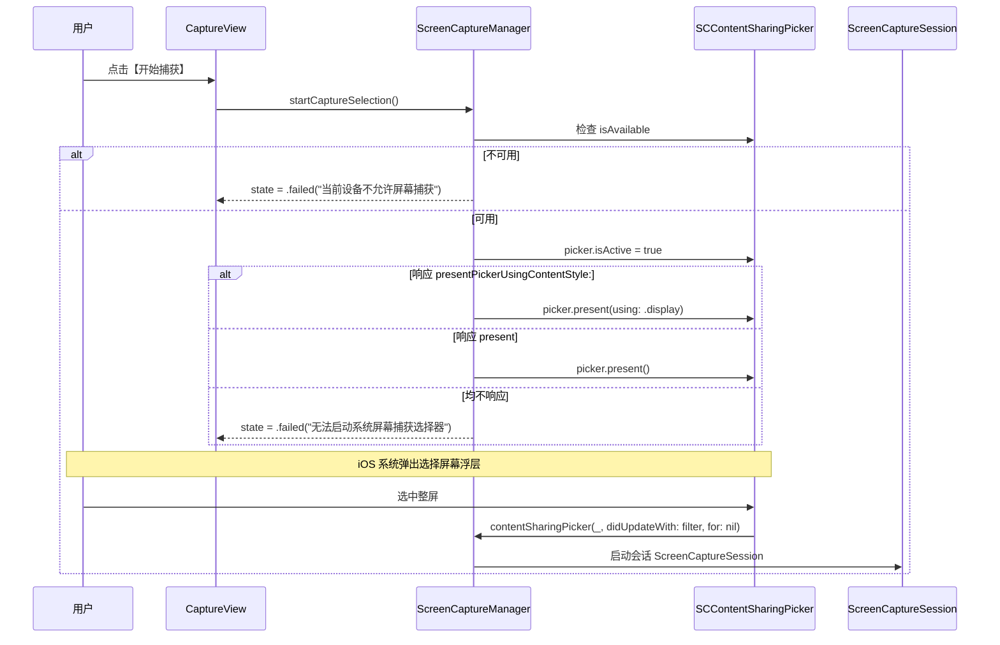

# 修复 iOS 27 真机点击开始捕获闪退设计文档（Design Spec）

本文档是解决真机点击【开始捕获】闪退缺陷的权威设计依据。

---

## 1. 方案与理由（Solution & Rationale）

### 1.1 缺陷根因深度剖析
1. 在之前为了解决 GitHub Actions（Xcode 16.4 / macOS 15）缺少 iOS 27 `ScreenCaptureKit` 系统头文件的问题时，工程中创建了 `Frameworks/ScreenCaptureKit.framework` 存根。
2. 存根头文件 `ScreenCaptureKit.h` 中错误声明了：
   ```objc
   typedef NS_ENUM(NSInteger, SCContentSharingPickerMode) { ... };
   - (void)presentUsing:(SCContentSharingPickerMode)mode NS_SWIFT_NAME(present(using:));
   ```
3. Clang 编译器据此为 `- (void)presentUsing:` 生成的 Objective-C 方法选择器（Selector）为 `presentUsing:`。
4. 在真机环境（iOS 27）下，根据苹果官方开发者文档定义，`SCContentSharingPicker` 的实际 Objective-C 符号为：
   - 枚举类型：`SCShareableContentStyle`（包含 `.none`, `.window`, `.display`, `.application`）；
   - 方法选择器：`- (void)presentPickerUsingContentStyle:(SCShareableContentStyle)contentStyle NS_SWIFT_NAME(present(using:));`
   - 备用无参选择器：`- (void)present;`
5. 当用户在 iOS 27 真机上点击【开始捕获】时，Swift 运行时按编译期存根调用 `[SCContentSharingPicker.shared presentUsing:0]`。由于 iOS 27 系统类中根本不存在 `presentUsing:` 选择器，Objective-C 运行时立刻抛出：
   `-[SCContentSharingPicker presentUsing:]: unrecognized selector sent to instance ...`
   直接触发 `SIGABRT`，表现为 App 瞬间闪退！

### 1.2 解决方案
1. **修正头文件与存根实现**：
   - 严格对照苹果官方文档，将 `ScreenCaptureKit.h` 中的选择器修正为 `presentPickerUsingContentStyle:`，枚举命名修正为 `SCShareableContentStyle`；
   - 增加 `- (void)present;` 声明；
   - 在 `ScreenCaptureKit_stub.m` 中实现对齐该方法名，确保 CI 生成的 Mach-O stub 能够导出且不破坏链接。
2. **在 `ScreenCaptureManager.swift` 中引入两级动态探测与容错降级**：
   - 在唤起前显式确保 `picker.isActive = true`；
   - 探测系统 `picker` 是否响应 `presentPickerUsingContentStyle:` 选择器：若是，调用 `present(using: .display)`；
   - 若不响应但响应 `present` 选择器：降级调用 `present()`；
   - 若均不响应（例如未来极端环境变动）：将状态设置为 `.failed(message: "系统选择器在此设备上暂不可用")` 并记录诊断日志，绝对不抛出致命异常造成闪退。

---

## 2. 接口契约与数据流（Interface Contract & Data Flow）

### 2.1 ScreenCaptureKit.h 接口契约
```objc
typedef NS_ENUM(NSInteger, SCShareableContentStyle) {
    SCShareableContentStyleNone = 0,
    SCShareableContentStyleWindow = 1,
    SCShareableContentStyleDisplay = 2,
    SCShareableContentStyleApplication = 3
};

@interface SCContentSharingPicker : NSObject
@property (class, nonatomic, readonly) SCContentSharingPicker *sharedPicker NS_SWIFT_NAME(shared);
@property (nonatomic, getter=isActive) BOOL active;
@property (nonatomic, readonly) BOOL isAvailable;
@property (nonatomic, copy) SCContentSharingPickerConfiguration *defaultConfiguration;

- (void)addObserver:(id<SCContentSharingPickerObserver>)observer NS_SWIFT_NAME(add(_:));
- (void)removeObserver:(id<SCContentSharingPickerObserver>)observer NS_SWIFT_NAME(remove(_:));
- (void)present;
- (void)presentPickerUsingContentStyle:(SCShareableContentStyle)contentStyle NS_SWIFT_NAME(present(using:));
@end
```

### 2.2 ScreenCaptureManager 交互数据流


---

## 3. 受影响文件清单（Affected Files List）

| 序号 | 目标文件路径 | 当前行数 | 预计增量 | 变更类型 |
|:---|:---|:---|:---|:---|
| 1 | `Frameworks/ScreenCaptureKit.framework/Headers/ScreenCaptureKit.h` | 76 | +5 / -5 | 修改 |
| 2 | `Frameworks/ScreenCaptureKit_stub.m` | 48 | +5 / -5 | 修改 |
| 3 | `LongShot/Core/Capture/ScreenCaptureManager.swift` | 213 | +15 / -2 | 修改 |
| 4 | `LongShotTests/ScreenCaptureManagerTests.swift` | 0 | +50 | 新建 |

---

## 4. 关键决策记录（Key Architectural Decisions）

1. **为什么必须精准映射 Selector 名称？**
   Swift 对 Clang Objective-C 框架的导入是通过 `@objc` 运行时消息分发的。如果头文件声明的 selector 与系统库底层实现的 selector 不匹配，Objective-C 运行时就会在调用时抛出 `NSInvalidArgumentException`（unrecognized selector），这在 Swift 中属于不可恢复的致命异常，只能依靠完全正确的头文件声明与运行时安全反射结合来杜绝。
2. **为什么增加 `responds(to:)` 探测？**
   iOS 27 在测试版或不同小版本更新期间，API 命名或分发形式可能存在微调。通过 `responds(to:)` 探测 `presentPickerUsingContentStyle:` 与 `present`，可以做到向前兼容与版本容错，即使 selector 命名发生变动也不会崩溃，保证 App 稳定存活。

---

## 5. 验收标准逐条回指（Traceability to AC）

- [ ] **AC1 回指 F1**：`ScreenCaptureKit.h` 中使用 `SCShareableContentStyle` 和 `presentPickerUsingContentStyle:`，在 clang 中正确生成符号。
- [ ] **AC2 回指 F2**：`ScreenCaptureManager.startCaptureSelection()` 在无论何种运行环境下，只要调用 `startCaptureSelection()` 均不崩溃；若选择器可用则调用展示，不可用则安全设置失败状态。
- [ ] **AC3 回指 F3**：`ScreenCaptureManagerTests` 覆盖正常可用检查与异常状态流，测试全部通过。

---

## 6. 用例表（Test Cases）

| 用例 ID | 测试条件 | 预期输出 |
|:---|:---|:---|
| TC-01 | 设备允许捕获且选择器响应标准样式方法 | 状态进入 `.selectingContent`，系统选择器正常唤起，零闪退 |
| TC-02 | 设备允许捕获但选择器仅响应无参 `present` | 状态进入 `.selectingContent`，无参选择器正常唤起，零闪退 |
| TC-03 | 模拟极端环境（选择器不响应任何展示方法） | 状态变为 `.failed` 并展示友好提示，零闪退 |
| TC-04 | `picker.isAvailable == false` | 状态变为 `.failed(message: "当前设备不允许屏幕捕获")` |

---

## 7. 边界（Boundaries）

- 核心修改严格限制在捕获初始化与头文件定义层（`ScreenCaptureKit.h`、`ScreenCaptureKit_stub.m`、`ScreenCaptureManager.swift`）；
- 不触碰后续拼图、马赛克、裁剪与文件导出的任何业务模块；
- 不调整 Xcode 架构与 deployment target 设置。

---

## 8. UI / 交互决策（UI / Interaction Decisions）

- 用户界面层无侵入：保持 `CaptureView` 与 `HomeView` 的原有交互体验；
- 失败提示优化：若选择器唤起失败，用户可在原界面的状态栏中清晰看到“系统选择器无法启动”的说明及红色警告，而不是直接退出 App。
