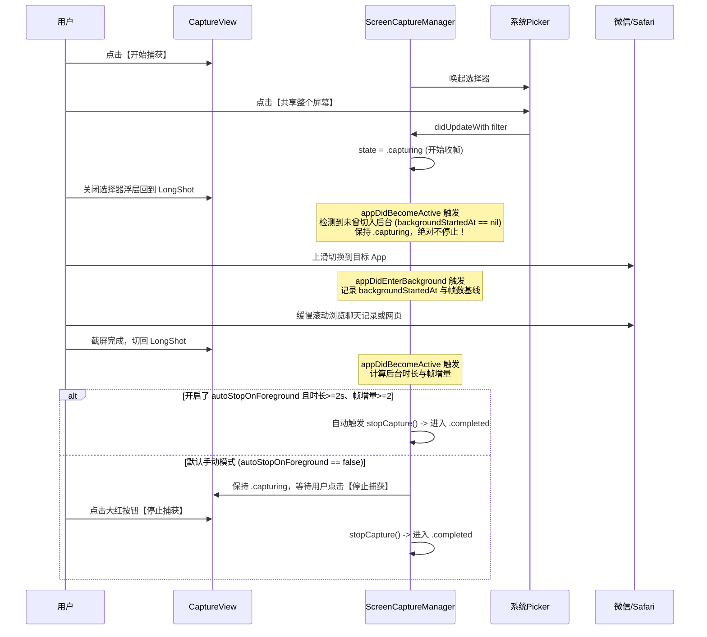

# 修复选择屏幕后关闭选择器误提前停止捕获设计文档（Design Spec）

本文档是解决用户在系统面板中选择屏幕后，返回 LongShot 误触发停止捕获缺陷的权威设计依据。

---

## 1. 方案与理由（Solution & Rationale）

### 1.1 缺陷根因深度剖析
1. 在 Phase 1 开发中，引入了 `autoStopOnForeground` 机制，旨在“切回 App 自动停止录屏”。
2. 当时的实现逻辑为：
   ```swift
   func appDidBecomeActive() {
       ...
       if autoStopOnForeground && state == .capturing && diagnostics.selectedFrames >= 2 {
           stopCapture()
       }
   }
   ```
   且 `autoStopOnForeground` 默认硬编码为 `true`。
3. **关键生命周期时序漏洞**：
   - 用户在 `CaptureView` 中点击【开始捕获】，系统弹出 `SCContentSharingPicker` 浮层；此时宿主 App 的 `scenePhase` 由 `.active` 变为 `.inactive`。
   - 用户在浮层中点击【共享整个屏幕】，系统 Observer 回调触发 `beginCapture()`，流管线启动，`state` 变为 `.capturing`，帧以 30~60fps 涌入，不到 0.2 秒 `selectedFrames` 即可达到 2 张以上。
   - 用户此时点击浮层外空白区域以关闭选择器浮层，画面切回 LongShot；宿主 App 的 `scenePhase` 再次变为 `.active`，触发 `appDidBecomeActive()`！
   - `appDidBecomeActive()` 检查：`autoStopOnForeground == true`、`state == .capturing`、`selectedFrames >= 2` 全部命中！
   - 结果：**在用户还没有来得及切出 LongShot 去打开微信或 Safari 的那一瞬间，`appDidBecomeActive()` 就把录屏强行终止了！** App 直接转为 `completed`（停止状态），导致长截图完全无法使用！

### 1.2 解决方案
1. **重构前台激活停止逻辑**：
   - 严禁仅凭 `state == .capturing && selectedFrames >= 2` 粗暴停止；
   - 增加前置判定：**必须真正进入过后台**（`backgroundStartedAt != nil`）；
   - 增加后台时间与帧数门槛：**后台驻留时长必须 $\ge 2.0$ 秒** 且 **后台采集到的有效帧增量 $\ge 2$ 帧**。若用户只是刚在 App 内开完面板关掉面板（`backgroundStartedAt == nil` 或后台时长不足），绝对不触发停止。
2. **默认策略转为安全手动，提供设置开关**：
   - 将 `autoStopOnForeground` 默认值变更为 `false`（默认完全由用户自主控制）；
   - 在 `CaptureView` 中加入 `Toggle("切回 LongShot 自动结束录制", isOn: $manager.autoStopOnForeground)`；
   - 用户可随时按习惯开启或关闭，清晰透明。
3. **界面操作体验强化**：
   - 在 `.capturing` 录制状态下，状态栏呈现动态录制呼吸动画与明确提示：“🟢 正在捕获整个屏幕！请上滑切换到需要截图的 App 缓慢向下滚动。录制完成后返回 LongShot 点击「停止捕获」，或点击顶部灵动岛/红点停止。”

---

## 2. 接口契约与数据流（Interface Contract & Data Flow）

### 2.1 ScreenCaptureManager 状态机时序


---

## 3. 受影响文件清单（Affected Files List）

| 序号 | 目标文件路径 | 当前行数 | 预计增量 | 变更类型 |
|:---|:---|:---|:---|:---|
| 1 | `LongShot/Core/Capture/ScreenCaptureManager.swift` | 225 | +10 / -5 | 修改 |
| 2 | `LongShot/Features/Capture/CaptureView.swift` | 157 | +18 / -2 | 修改 |
| 3 | `LongShotTests/ScreenCaptureManagerTests.swift` | 45 | +35 | 修改 |

---

## 4. 关键决策记录（Key Architectural Decisions）

1. **为什么默认关闭 `autoStopOnForeground`？**
   在 iOS 生态下，绝大多数滚动长截图 App（如 Picsew、Tailor 等）均采用「手动返回点击停止」或「点击系统状态栏红点停止」作为主要交互范式。手动模式让用户始终清楚“现在在录制”还是“录制已结束”，避免因切后台/前台误判造成截断。
2. **为什么增加后台时长与帧数双门槛？**
   对于希望启用自动切回停止的用户，严格的后台时长（$\ge 2.0\text{s}$）与帧增量（$\ge 2$ 帧）保障了即使关闭 Picker 引起瞬态后台切换，也不会被错误判定为一次完整的外部 App 截屏过程。

---

## 5. 验收标准逐条回指（Traceability to AC）

- [ ] **AC1 回指 F1**: 在 `ScreenCaptureManagerTests` 中，模拟 `state == .capturing` 时直接调用 `appDidBecomeActive()`（模拟关闭浮层），捕获状态稳定维持在 `.capturing`，未被误停止。
- [ ] **AC2 回指 F2**: 模拟真实经历后台（时长 $\ge 2$ 秒，帧增量 $\ge 2$），测试开启与关闭 `autoStopOnForeground` 的行为分别符合预期。
- [ ] **AC3 回指 F3 & F4**: 界面指引显示完整，全量单测 Exit 0 通过。

---

## 6. 用例表（Test Cases）

| 用例 ID | 测试前置条件 | 执行动作 | 预期结果 |
|:---|:---|:---|:---|
| TC-01 | 刚在 App 内完成选择器选屏，未切出后台 | 浮层消失触发 `appDidBecomeActive` | `state` 保持 `.capturing`，继续录制，零提前停止 |
| TC-02 | 处于录制中，用户切出后台不足 2 秒即切回 | 切回触发 `appDidBecomeActive` | 判定为偶发切换，不触发自动停止 |
| TC-03 | 用户切出后台 5 秒，在微信滚动产生 100 帧并切回，`autoStopOnForeground = false` | 切回触发 `appDidBecomeActive` | `state` 保持 `.capturing`，界面清晰展示捕获帧数与红色【停止捕获】按钮 |
| TC-04 | 用户切出后台 5 秒，在微信滚动产生 100 帧并切回，`autoStopOnForeground = true` | 切回触发 `appDidBecomeActive` | 满足条件自动调用 `stopCapture()`，顺利结转至长图拼接 |

---

## 7. 边界（Boundaries）

- 仅修正生命周期触发与 CaptureView 状态交互，严格不触碰后续拼接引擎、马赛克、裁剪与文件导出的既有实现；
- 保持所有 Swift 存根与 CI 构建脚本不变。

---

## 8. UI / 交互决策（UI / Interaction Decisions）

- 在 `CaptureView` 的“操作提示”或“捕获状态”区域增加清晰直观的开关：`Toggle("切回 LongShot 自动结束录制", isOn: $manager.autoStopOnForeground)`；
- 在正在捕获时显示易懂的横幅操作指引，告知用户当前录制正常运转，请放心切换到目标 App 滚动。
